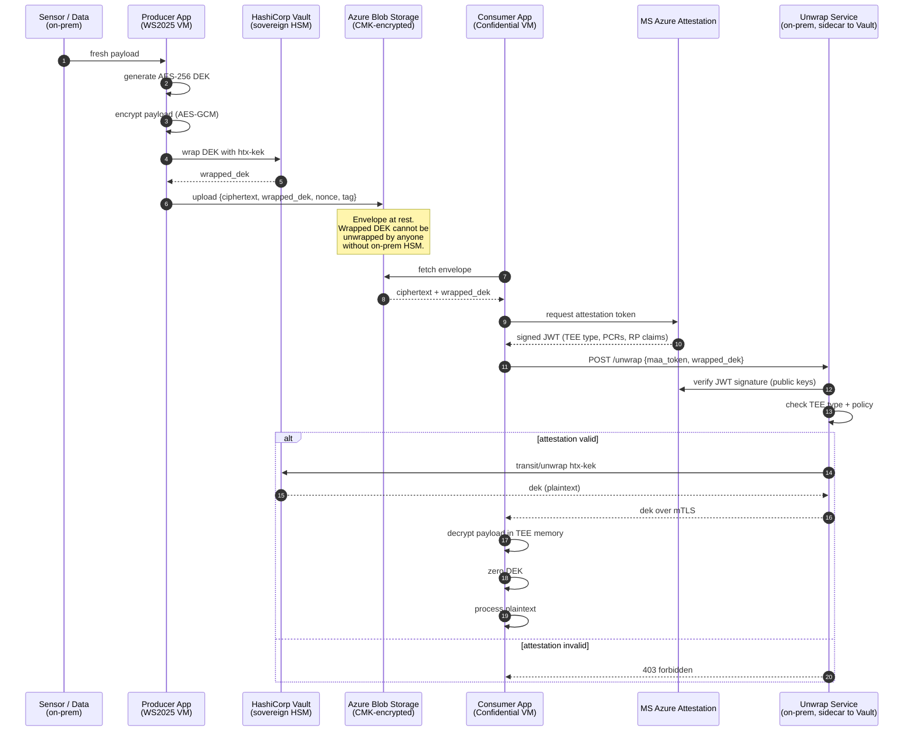

# Sovereign Data Pipeline — Producer / Unwrap / Consumer

**The story:** encrypted data flows from the sovereign edge to Azure, and the key stays on-prem the entire time. A Confidential VM in Azure proves its identity to an on-prem attestation gate, which releases the data-encryption key only after verifying the quote. Microsoft never sees plaintext or keys.

## The three apps

| App | Runs on | Purpose |
|---|---|---|
| **`producer/`** | ALDO — Windows Server 2025 VM (`htxaldo-foundry`) | Gather synthetic sensor telemetry, generate per-blob AES-256 DEK, encrypt payload, wrap DEK with `htx-kek` via on-prem Vault, upload envelope + ciphertext to Azure Storage. |
| **`unwrap-service/`** | ALDO — Vault VM (`htxaldo-vault`, sidecar to Vault) | HTTP endpoint `POST /unwrap`. Accepts a Microsoft Azure Attestation (MAA) quote from a CVM + a wrapped DEK. Verifies the quote signature and TEE type. Only on success calls Vault Transit unwrap and returns the plaintext DEK. |
| **`consumer/`** | Azure — `acxhtx-vm` (Trusted Launch stand-in today; SEV-SNP CVM when capacity returns) | Fetch encrypted envelope from Azure Blob, obtain a fresh MAA attestation token from the guest attestation library, POST to the on-prem unwrap service, decrypt payload in memory, do downstream processing, discard the DEK. |

## The critical property

**The DEK's plaintext lifetime:**

- **In the Producer:** generated locally, used to encrypt, immediately wrapped by Vault. Discarded.
- **In transit to Azure:** wrapped only — ciphertext form.
- **At rest in Azure Storage:** wrapped only.
- **In transit back to on-prem:** wrapped only.
- **Inside the Unwrap Service:** unwrapped briefly, returned over mTLS.
- **In the Consumer:** in TEE memory only, held for the duration of one decrypt operation, then explicitly zeroed.

**Microsoft's control plane never sees the DEK in plaintext.** The on-prem HSM never leaves the boundary.

## Sequence diagram



## Envelope format

```json
{
  "version": 1,
  "kek_name": "htx-kek",
  "wrapped_dek": "vault:v1:<base64>",
  "nonce": "<base64, 12 bytes>",
  "tag": "<base64, 16 bytes>",
  "ciphertext": "<base64>",
  "created_utc": "2026-09-08T21:40:00Z",
  "producer_id": "htxaldo-foundry",
  "content_type": "application/json+drone-telemetry"
}
```

Stored as `sovereign-encrypted/<producer>/<yyyy>/<mm>/<dd>/<uuid>.envelope.json` in the Azure Storage account (`acxhtxstgaguuve6oq6by6`).

## What the unwrap service checks

Configurable policy in `unwrap-service/policy.yaml`:

- **JWT signature** — verified against MAA's published signing keys (JWKS)
- **`iss`** — must be one of the trusted MAA endpoints
- **`x-ms-attestation-type`** — must be `sevsnpvm` (or `tpm` if allow-list includes Trusted Launch for demo)
- **`x-ms-compliance-status`** — must be `azure-compliant-cvm` (or equivalent for TL)
- **`x-ms-runtime`** — should include a fresh nonce we issue per unwrap call (prevents replay)
- **`x-ms-azurevm-vmid`** — must be in the allow-list of known consumer VMs

Demo mode (`HTX_DEMO_MODE=1`) logs "would reject" instead of rejecting, so the wire flows even against a Trusted Launch VM that doesn't fully match SEV-SNP claims.

## Setup

### Producer (ALDO Foundry VM)

```powershell
# On htxaldo-foundry
python -m venv C:\HTX\producer\.venv
C:\HTX\producer\.venv\Scripts\pip install -r apps/producer/requirements.txt

$env:HTX_VAULT_ADDR      = 'http://172.22.218.200:8200'
$env:HTX_VAULT_TOKEN     = '<producer app-role token from Vault>'
$env:HTX_KEK_NAME        = 'htx-kek'
$env:HTX_STORAGE_ACCOUNT = 'acxhtxstgaguuve6oq6by6'
$env:HTX_CONTAINER       = 'sovereign-encrypted'
$env:HTX_PRODUCER_ID     = 'htxaldo-foundry'

C:\HTX\producer\.venv\Scripts\python apps/producer/producer.py
```

Storage authentication uses `DefaultAzureCredential` — sign in with `az login` or attach a managed identity to the VM.

### Unwrap Service (ALDO Vault VM)

```bash
# On htxaldo-vault
sudo apt-get install -y python3-venv
python3 -m venv /opt/htx-unwrap/.venv
/opt/htx-unwrap/.venv/bin/pip install -r apps/unwrap-service/requirements.txt

export HTX_VAULT_ADDR='http://127.0.0.1:8200'
export HTX_VAULT_TOKEN='<unwrap app-role token>'
export HTX_KEK_NAME='htx-kek'
export HTX_LISTEN_ADDR='0.0.0.0:8443'
export HTX_POLICY_PATH='/opt/htx-unwrap/policy.yaml'
export HTX_DEMO_MODE='1'    # remove for production

/opt/htx-unwrap/.venv/bin/python apps/unwrap-service/unwrap.py
```

For real mTLS use gunicorn + a reverse proxy (nginx or Caddy) with client-cert auth in production.

### Consumer (Azure CVM `acxhtx-vm`)

```powershell
# On acxhtx-vm (via Bastion or serial console)
python -m venv C:\HTX\consumer\.venv
C:\HTX\consumer\.venv\Scripts\pip install -r apps/consumer/requirements.txt

$env:HTX_STORAGE_ACCOUNT = 'acxhtxstgaguuve6oq6by6'
$env:HTX_CONTAINER       = 'sovereign-encrypted'
$env:HTX_BLOB_NAME       = 'htxaldo-foundry/2026/09/08/<uuid>.envelope.json'
$env:HTX_UNWRAP_URL      = 'http://172.22.218.200:8443/unwrap'   # demo private endpoint
$env:HTX_UNWRAP_VERIFY_TLS = '0'    # demo only; require cert in prod

C:\HTX\consumer\.venv\Scripts\python apps/consumer/consumer.py
```

## Known limitations

- The deployed `acxhtx-vm` is a Windows Server 2022 Trusted Launch VM, not an
  SEV-SNP CVM. Its IMDS attested-document endpoint returns a signed document
  whose `signature` field is not a MAA JWT. With `HTX_DEMO_MODE=1`, the unwrap
  service logs this mismatch as `trusted-launch-demo` and permits the demo
  flow. Production mode rejects malformed, untrusted, or invalidly signed
  tokens.
- The demo unwrap endpoint is HTTP on the private routed network. Production
  requires TLS with client-certificate authentication.
- Private DNS did not resolve the storage private endpoint from the ALDO
  Foundry VM during deployment. The observed endpoint address,
  `10.255.250.8`, was added to the guest hosts file as a temporary demo
  workaround.

## What we upgrade to production

| Demo today | Production |
|---|---|
| HashiCorp Vault (software) | Luna HSM (hardware) |
| Attestation over HTTPS | Attestation over mTLS with cert-manager-issued client certs |
| Single `htx-kek` | Per-tenant / per-workload keys with rotation policy |
| Trusted Launch consumer | SEV-SNP CVM (or TDX) with real PCR quote |
| Producer as scheduled task | Streaming ingest via IoT Hub / Event Hubs behind private endpoints |

## Talking point for leadership

> "The critical property is not that we encrypted the data. It's that the key never went to Azure. When the Confidential VM needs to read the data, it has to *prove its identity* to our on-prem service — and only then does the on-prem HSM briefly release the DEK. Watch the traffic in Wireshark: the Vault only talks to on-prem addresses. The key never crosses the boundary in plaintext, and never crosses it wrapped-by-a-cloud-key either. It stays with the customer, always."
