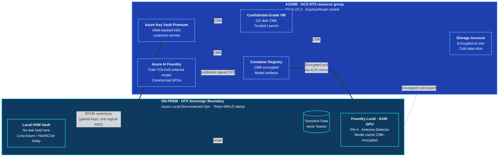

# HTX Sovereign Hybrid AI — 1130 Brief

**One sentence:** HTX keeps its keys, sensitive data, and inference on-prem while borrowing Azure's scale for storage, training, and non-sensitive processing — with one cryptographic boundary spanning both sides.

---

## The picture

---

## What HTX gets

| Claim | Proof |
|---|---|
| **Customer holds every key** | HSM-backed vaults on both sides. Microsoft can't read anything. |
| **Sensitive data stays on-prem** | A100 GPU + Foundry Local inside the HTX boundary. Data never leaves in plaintext. |
| **Azure adds scale without exposure** | Storage, container registry, and non-sensitive training all CMK-encrypted with HTX's key. |
| **Revoke = read denied** | One command locks storage, VM disks, ACR images, and the on-prem model cache. |
| **Sovereign at every layer** | Same customer key protects data at rest, disks at rest, model artifacts at rest, and inference cache at rest. |

---

## What's already built (Azure side, live)

- Resource group `ACX-HTX` in West US 2, deployed via Bicep, GitHub: `mgodfre3/ACX-HTX`
- Key Vault Premium with HSM-backed `htx-kek`
- Storage account with customer-managed key
- CMK-encrypted VM (D2as_v5, Trusted Launch, no public IP)
- Premium ACR with CMK
- Azure AI Foundry hub + project
- Private endpoints only — no public network path

## What's building now (ALDO side)

- HashiCorp Vault VM (Ubuntu 24.04) — on-prem mirror of `htx-kek`
- Foundry Local VM (Windows Server 2025 + A100 DDA passthrough) — sovereign inference host
- Optional Windows Server 2025 jumpbox

## What we'll show

1. **Train an antenna-detection model in Azure Foundry** — data + weights CMK-encrypted end-to-end
2. **Publish the signed model** to CMK-encrypted ACR
3. **Pull to on-prem** via ACR Connected Registry mirror
4. **Run inference on the A100** inside HTX's boundary via Foundry Local
5. **Revoke the KEK** — watch storage, ACR, VM disks, and on-prem model cache all lock simultaneously

---

## The evolution path (not for the demo, for the story)

| Phase | Vault | Trust anchor | Timeline |
|---|---|---|---|
| **Demo** | HashiCorp Vault stand-in | Software HSM | Now |
| **Pilot** | Azure Key Vault Managed HSM + on-prem Luna | Real HSM both sides | Months |
| **Production** | Dual-Luna, BYOK-imported customer master key | Customer-owned HSM ceremony | Years — planned, budgeted |

The architecture is unchanged across all three. Only the key custody hardware evolves.

---

## Talking points if asked

- **"Why not Confidential VMs everywhere?"** — SEV-SNP capacity isn't available on this subscription's hardware in any US region today. The Trusted Launch + CMK story is the "closest possible" implementation now; SEV-SNP swaps in later with a config flag, no architecture change.
- **"Why not Arc-AKS?"** — A100 GPUs aren't supported on AKS-Arc (T4/A2 only). Foundry Local on Windows Server 2025 with DDA passthrough is the same pattern the MWC Adaptive Cloud Lab demos already use in production.
- **"How do we know Microsoft can't read the data?"** — CMK design: the storage/disks/registry request a wrap operation from Key Vault whenever they need to touch the DEK. Revoke the KEK → they can't wrap → the data-encryption keys stay encrypted → the underlying bytes are unreadable ciphertext.
- **"What about the training side?"** — Azure AI Foundry compute clusters store artifacts on CMK-encrypted storage. The trained model is pushed to CMK-encrypted ACR. The customer key protects every stage — Microsoft's control-plane only ever sees ciphertext.

---

*Repo: https://github.com/mgodfre3/ACX-HTX*
*Full exec summary: `docs/executive-summary.md`*
*Deployment status: `docs/deployment-status.md`*
