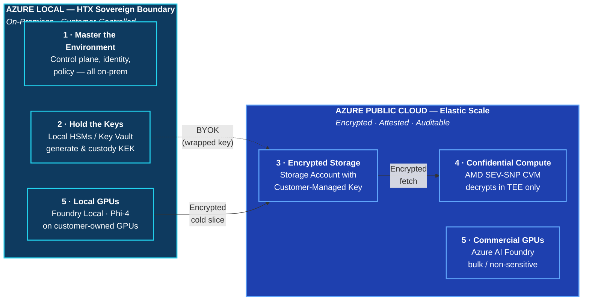
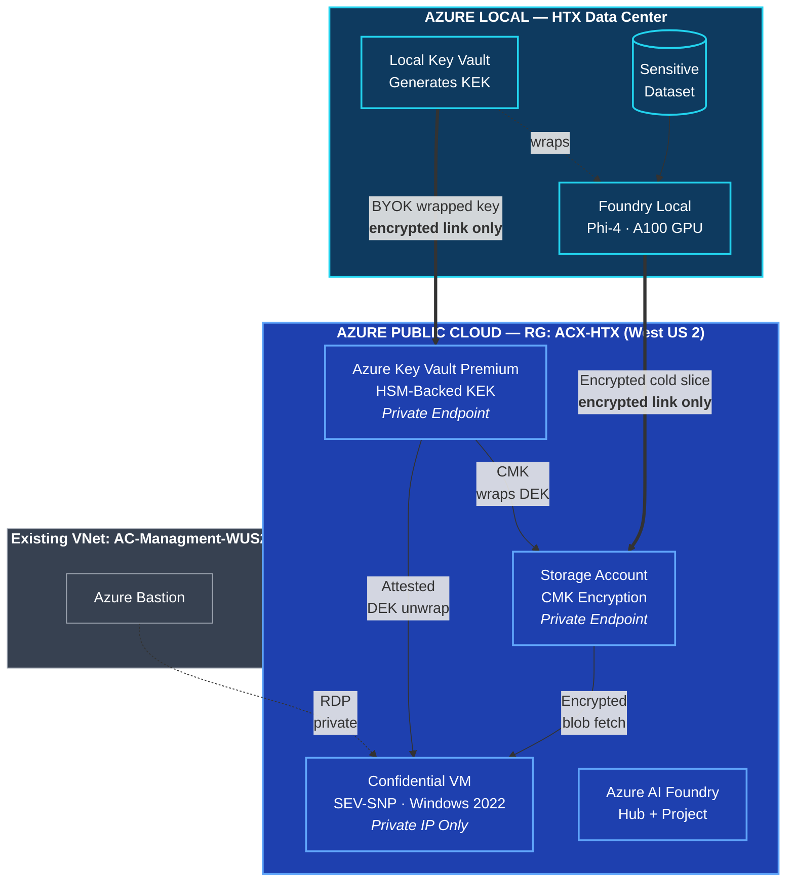

# Master the Environment. Extend the Scale.

## Executive Summary — Sovereign Hybrid Compute Demo

**Date:** September 2026
**Audience:** HTX Leadership
**Prepared by:** Michael Godfrey, Adaptive Cloud Lab

---

## The Problem

Sensitive workloads have historically been treated as a binary choice: keep them on-premises and give up cloud scale, or move them to the cloud and give up sovereignty. Neither answer works for HTX.

## The Solution: One Architecture, One Boundary

We demonstrate a **sovereign hybrid architecture** that gives HTX both — a single, provable security boundary that spans Azure Local (on-premises) and Azure public cloud, with keys and sensitive processing anchored inside HTX's data center.

## What This Demo Proves

| Claim | Evidence In The Demo |
|-------|----------------------|
| **HTX owns the environment.** | Azure Local runs the identity, policy, and control plane on-premises. Nothing on the sensitive path traverses Microsoft's operator plane. |
| **HTX owns the keys.** | The key encryption key (KEK) is generated inside a **hardware-backed** Key Vault. The Azure copy is a bring-your-own-key representation. Microsoft has no path to plaintext. |
| **Sensitive data is processed locally.** | Classified inference runs on customer-owned GPUs inside the boundary via Foundry Local. Data never leaves the site in plaintext. |
| **Azure adds scale without adding exposure.** | Cold-slice data is encrypted on-prem with the local DEK, wrapped with the KEK, then shipped to Azure Blob. Microsoft holds ciphertext only. |
| **When Azure processes the data, it happens inside a TEE.** | An AMD SEV-SNP Confidential VM attests to Microsoft Azure Attestation, unwraps the DEK via Key Vault, decrypts **in memory inside the enclave**, and produces a result. The Azure operator plane cannot read enclave memory. |
| **Less-sensitive workloads still get commercial-scale GPUs.** | Bulk training and non-sensitive inference route to Azure AI Foundry — pay-as-you-go, elastic, and separated by policy from the sovereign path. |

## The Sovereign Boundary is Cryptographic, Not Geographic

Traditional "sovereign cloud" stories rely on where the data sits. Ours relies on **who can read it**. That answer is: only HTX, and only inside attested hardware. The physical boundary and the cryptographic boundary reinforce each other — but even if the storage account were world-readable, the ciphertext would still be worthless without the customer-controlled KEK.

## What's In The Live Demo Today

**Deployed and ready (Azure side, live in RG `ACX-HTX` today):**
- Azure Key Vault Premium with HSM-backed customer KEK `htx-kek`
- Storage account with customer-managed key encryption
- Windows Server 2022 VM with Trusted Launch and OS disk encrypted by the customer KEK via a Disk Encryption Set — same key-custody story as a Confidential VM; SEV-SNP memory encryption swaps in later
- **Azure AI Foundry hub + project + CMK-encrypted Azure Container Registry** — the model training + distribution registry, protected by the same customer KEK
- Private endpoints (no public IPs anywhere in the sovereign path)
- Managed identity + least-privilege RBAC wiring

**One key, three surfaces, one boundary.** `htx-kek` backs the Storage CMK, the VM disk CMK, and the ACR CMK simultaneously. Revoke it once — everything encrypted at rest becomes unreadable. That's the demo.

**Model lifecycle (new):** YOLOv8 cell-antenna detector training script + Azure ML job spec (`training/`), and Arc-AKS deployment manifests + ACR Connected Registry Bicep for distribution to ALDO stamps (`arc-aks/`). Reference architecture until the Tokyo WKLD stamp is ready.

**Design note:** The "Strong" tier (CMK + Trusted Launch) is the closest solution available on this subscription's hardware today. The "Strongest" tier (Confidential VM with SEV-SNP memory encryption + guest attestation) requires capacity that Azure has not offered on any hardware cluster this subscription is currently assigned to. The demo narrative is unchanged; the upgrade path is a config flag.

**In flight (Azure side, awaiting capacity):**
- AMD SEV-SNP Confidential VM — blocked on SKU capacity across every US region tested; slot ready in Bicep behind `deployCvm` flag

**Ready to bolt on (Azure Local side, in flight):**
- Azure Local Disconnected Operations stamp with A100 GPUs
- Foundry Local running Phi-4 inference
- Local key vault generating and holding the KEK

**Deferred until production ceremony:**
- Real Luna HSM (Azure Key Vault Premium HSM is stand-in for the demo — the customer-facing story is unchanged)
- GPU-backed Confidential VMs (Azure has single-H100 today; the confidentiality flow is the same)

## What Leadership Should Take Away

1. **This is not a slideware promise.** Every architectural component in the picture exists and is operational today. The demo runs end-to-end.
2. **Microsoft cannot read HTX data — by construction, not by policy.** Keys are hardware-custody. Compute is enclave-attested. The trust model does not depend on Microsoft.
3. **HTX gets sovereignty and scale.** Sensitive processing stays on-prem. Elastic storage and non-sensitive compute burst to Azure. One boundary, one operational model.
4. **The path to Luna-HSM production is short.** The demo's key vault is a drop-in stand-in. Wiring Luna HSMs on both sides is procurement + integration, not architecture change.

## Reference Architecture (Live Deployment)

## Cost & Governance

- **Single resource group:** `ACX-HTX` in West US 2
- **Standard tags on every resource:** `Project=HTX`, `Created By=Michael Godfrey`
- **All infrastructure as code:** Bicep, version-controlled at [github.com/mgodfre3/ACX-HTX](https://github.com/mgodfre3/ACX-HTX)
- **Reproducible teardown:** one command removes the environment cleanly
- **Estimated monthly run cost (idle):** ~$400 (Key Vault Premium keys + CVM stopped + Foundry hub)

## Next Steps

1. **Complete the Azure Local Disconnected Operations bolt-on** (Foundry Local on A100, real BYOK ceremony)
2. **Schedule Luna HSM procurement + integration** (parallel workstream)
3. **Present live demo to HTX leadership** — 5 minutes end-to-end
